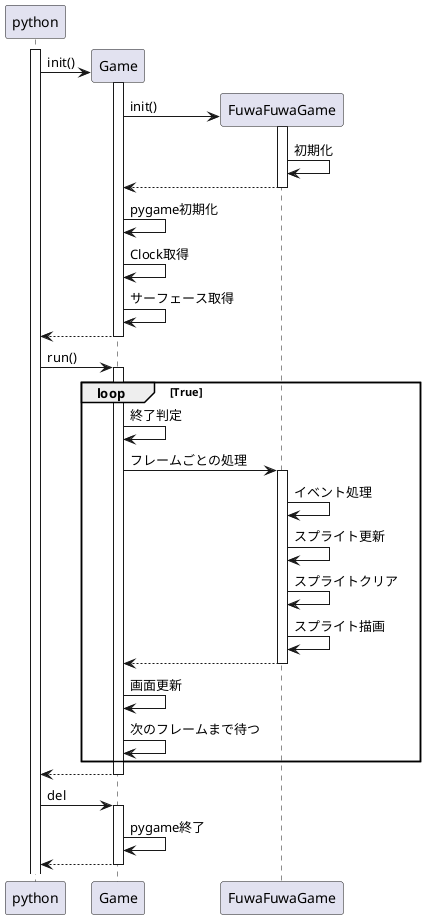
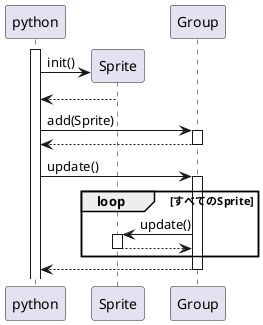
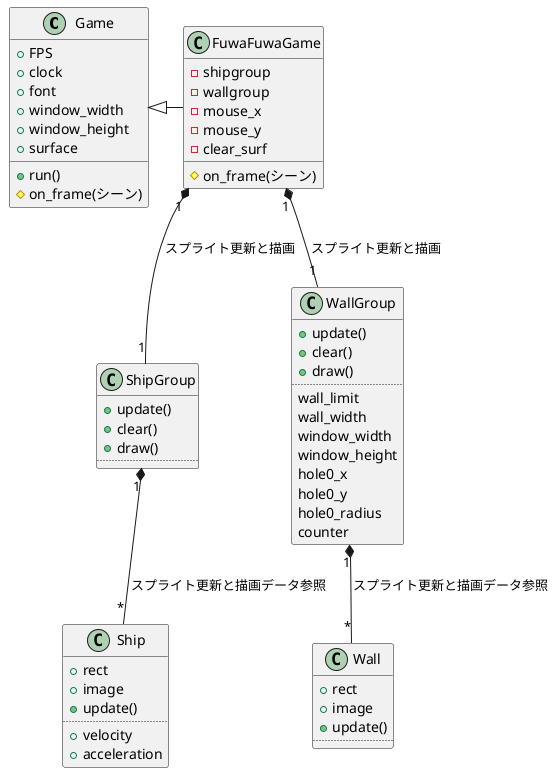

# fuwafuwa

## シーケンス図

## クラス図

## 説明
### class Game
- コンストラクタ
    pygameの初期化、サーフェースの準備
- デストラクタ
    pygameの終了など
- run
    メインループ
    ｘボタンなどの終了だけ処理
    画面の更新とフレーム待ちは行う。
    それ以外のゲーム内のオブジェクトの更新は、その派生クラスのupdate()で処理されることを期待
- on_frame
    ゲーム内のオブジェクトを更新する。
    マウス、キーボードのイベント処理はここでやる。

### class Ship
自機
- update
    速度の計算（ボタンON：上昇方向／ボタンOFF：下降方向）
    位置を更新

### class ShipGroup
自機グループ

### class Wall
壁
- update()
    位置を更新（１ブロック、左に移動）

### class WallGroup
壁グループ
- update()
    画面右外に壁を作成
    画面左外に消えたら削除
