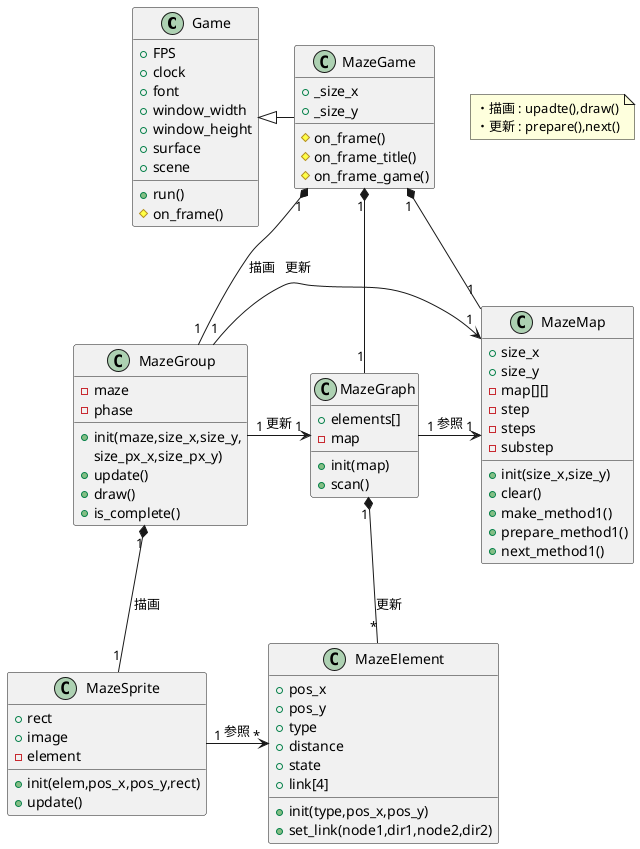

## クラス図

```puml
@startuml

class Game
{
    + FPS
    + clock
    + font
    + window_width
    + window_height
    + surface
    + scene

    + run()
    # on_frame()
}

class MazeGame
{
    + _size_x
    + _size_y
    # on_frame()
    # on_frame_title()
    # on_frame_game()
}

class MazeMap
{
    + size_x
    + size_y
    - map[][]
    - step
    - steps
    - substep
    + init(size_x,size_y)
    + clear()
    + make_method1()
    + prepare_method1()
    + next_method1()
}

class MazeGraph
{
    + elements[]
    - map
    + init(map)
    + scan()
}

class MazeElement
{
    + pos_x
    + pos_y
    + type
    + distance
    + state
    + link[4]
    + init(type,pos_x,pos_y)
    + set_link(node1,dir1,node2,dir2)
}

class MazeGroup
{
    - maze
    - phase
    + init(maze,size_x,size_y,
            size_px_x,size_px_y)
    + update()
    + draw()
    + is_complete()
}

class MazeSprite
{
    + rect
    + image
    - element
    + init(elem,pos_x,pos_y,rect)
    + update()
}

Game <|- MazeGame
MazeGame   "1" *-- "1" MazeMap
MazeGame   "1" *-- "1" MazeGraph
MazeGame   "1" *-- "1" MazeGroup   : 描画

MazeGraph  "1" ->  "1"  MazeMap    : 参照
MazeGraph  "1" *-- "*" MazeElement : 更新

MazeGroup  "1" ->  "1" MazeMap     : 更新
MazeGroup  "1" ->  "1" MazeGraph   : 更新
MazeGroup  "1" *-- "1" MazeSprite  : 描画

MazeSprite "1" ->  "*" MazeElement : 参照


note as a
・描画 : upadte(),draw()
・更新 : prepare(),next()
end note

hide LinkSprite
hide GraphGroup

@enduml


```

