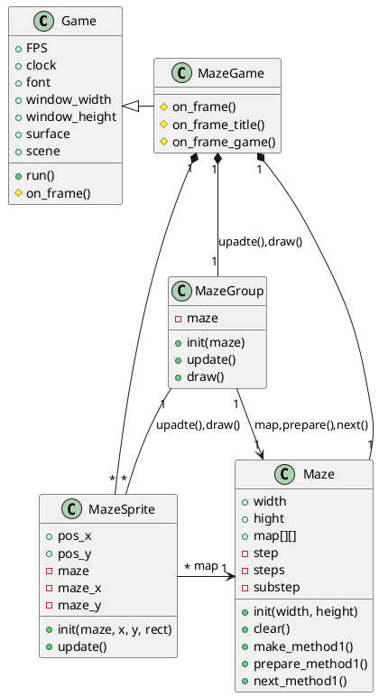

## クラス図

```puml
@startuml

class Game
{
    + FPS
    + clock
    + font
    + window_width
    + window_height
    + surface
    + scene

    + run()
    # on_frame()
}

class MazeGame
{
    # on_frame()
    # on_frame_title()
    # on_frame_game()
}

class Maze
{
    + width
    + hight
    + map[][]
    - step
    - steps
    - substep
    + init(width, height)
    + clear()
    + make_method1()
    + prepare_method1()
    + next_method1()
}

class MazeGroup
{
    - maze
    + init(maze)
    + update()
    + draw()
}

class MazeSprite
{
    + pos_x
    + pos_y
    - maze
    - maze_x
    - maze_y
    + init(maze, x, y, rect)
    + update()


}

Game <|- MazeGame
MazeGame   "1"  *-- "1" Maze
MazeGame   "1"  *-- "1" MazeGroup   : upadte(),draw()
MazeGame   "1"  *-- "*" MazeSprite

MazeGroup  "1"  --> "1" Maze        : map,prepare(),next()
MazeGroup  "1"  --  "*" MazeSprite  : upadte(),draw()
MazeSprite "*"  ->  "1" Maze        : map


@enduml
```

---
