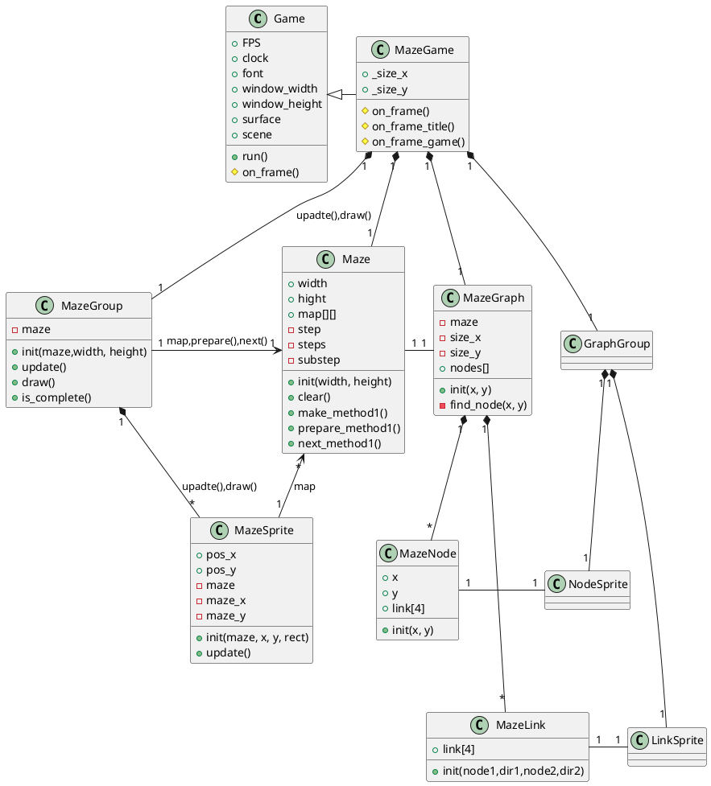

## クラス図

```puml
@startuml

class Game
{
    + FPS
    + clock
    + font
    + window_width
    + window_height
    + surface
    + scene

    + run()
    # on_frame()
}

class MazeGame
{
    + _size_x
    + _size_y
    # on_frame()
    # on_frame_title()
    # on_frame_game()
}

class Maze
{
    + width
    + hight
    + map[][]
    - step
    - steps
    - substep
    + init(width, height)
    + clear()
    + make_method1()
    + prepare_method1()
    + next_method1()
}

class MazeGroup
{
    - maze
    + init(maze,width, height)
    + update()
    + draw()
    + is_complete()
}

class MazeSprite
{
    + pos_x
    + pos_y
    - maze
    - maze_x
    - maze_y
    + init(maze, x, y, rect)
    + update()
}

class MazeGraph
{
    - maze
    - size_x
    - size_y
    + nodes[]

    + init(x, y)
    - find_node(x, y)
}

class MazeNode
{
    + x
    + y
    + link[4]
    + init(x, y)
}

class MazeLink
{
    + link[4]
    + init(node1,dir1,node2,dir2)
}


Game <|- MazeGame
MazeGame    "1"  *-   "1" Maze
MazeGame    "1"  *--  "1" MazeGroup   : upadte(),draw()
MazeGame    "1"  *--  "1" GraphGroup
MazeGame    "1"  *--  "1" MazeGraph

MazeGroup   "1"  ->   "1" Maze        : map,prepare(),next()
MazeGroup   "1"  *--  "*" MazeSprite : upadte(),draw()
Maze        "*"  <--  "1" MazeSprite : map

Maze        "1"  -    "1" MazeGraph
MazeGraph   "1"  *--  "*" MazeNode
MazeGraph   "1"  *--- "*" MazeLink

GraphGroup  "1"  *--  "1" NodeSprite
GraphGroup  "1"  *--- "1" LinkSprite
MazeNode    "1"  -    "1" NodeSprite 
MazeLink    "1"  -    "1" LinkSprite 

@enduml
```

---
