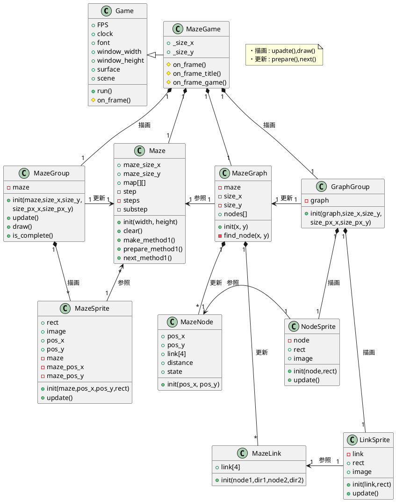

## クラス図

```puml
@startuml

class Game
{
    + FPS
    + clock
    + font
    + window_width
    + window_height
    + surface
    + scene

    + run()
    # on_frame()
}

class MazeGame
{
    + _size_x
    + _size_y
    # on_frame()
    # on_frame_title()
    # on_frame_game()
}

class Maze
{
    + maze_size_x
    + maze_size_y
    + map[][]
    - step
    - steps
    - substep
    + init(width, height)
    + clear()
    + make_method1()
    + prepare_method1()
    + next_method1()
}

class MazeGroup
{
    - maze
    + init(maze,size_x,size_y,
            size_px_x,size_px_y)
    + update()
    + draw()
    + is_complete()
}

class MazeSprite
{
    + rect
    + image
    + pos_x
    + pos_y
    - maze
    - maze_pos_x
    - maze_pos_y
    + init(maze,pos_x,pos_y,rect)
    + update()
}

class MazeGraph
{
    - maze
    - size_x
    - size_y
    + nodes[]

    + init(x, y)
    - find_node(x, y)
}

class MazeNode
{
    + pos_x
    + pos_y
    + link[4]
    + distance
    + state
    + init(pos_x, pos_y)
}

class MazeLink
{
    + link[4]
    + init(node1,dir1,node2,dir2)
}

class GraphGroup
{
    - graph
    + init(graph,size_x,size_y,
            size_px_x,size_px_y)
}

class NodeSprite
{
    - node
    + rect
    + image
    + init(node,rect)
    + update()
}

class LinkSprite
{
    - link
    + rect
    + image
    + init(link,rect)
    + update()
}


Game <|- MazeGame
MazeGame    "1"  *-   "1" Maze
MazeGame    "1"  *--  "1" MazeGroup   : 描画
MazeGame    "1"  *--  "1" MazeGraph
MazeGame    "1"  *--  "1" GraphGroup  : 描画

MazeGroup   "1"  ->   "1" Maze        : 更新
MazeGroup   "1"  *--  "*" MazeSprite  : 描画
Maze        "*"  <--  "1" MazeSprite  : 参照

Maze        "1"  <-   "1" MazeGraph   : 参照
MazeGraph   "1"  <-   "1" GraphGroup  : 更新
MazeGraph   "1"  *--  "*" MazeNode    : 更新
MazeGraph   "1"  *--- "*" MazeLink    : 更新

GraphGroup  "1"  *--  "1" NodeSprite  : 描画
GraphGroup  "1"  *--- "1" LinkSprite  : 描画
MazeNode    "1"  <-    "1" NodeSprite : 参照
MazeLink    "1"  <-    "1" LinkSprite : 参照

note as a
・描画 : upadte(),draw()
・更新 : prepare(),next()
end note
@enduml

```

