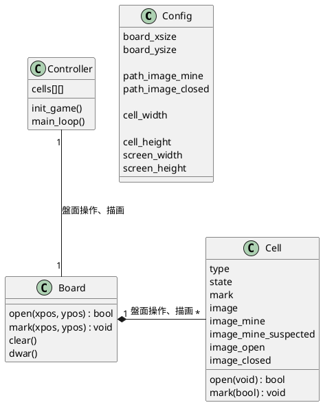

---
- class Config
    - board_size_x
        ボードのセル数X [セル]
    - board_size_y
        ボードのセル数Y [セル]

    - image_mine
        地雷イメージ（サーフェース）
    - image_closed
        地面イメージ（サーフェース）

    - cell_width
        セル幅 [ピクセル]
    - cell_height
        セル高 [ピクセル]
    - screen_width
        スクリーン幅 [ピクセル]
    - screen_height
        スクリーン高 [ピクセル]

---
- class Controller
    - init()
        ゲームの初期化
    - main_loop()
        メインループ処理
        - マウスイベントを拾って、操作結果反映。
        - 描画（クリアと描画）

---
- class Board
    - cells[][]
        Cellオブジェクトを保持する2次元配列
    - init()
        以下を実施。
        - Cellオブジェクトの生成
        - 地雷の設置
        - 各Cellオブジェクトの周りの地雷のカウント→image_openの作成
    - mark()
        盤面操作（マーキング）
        座標に対応するCellに対してmark()を呼び出す。
    - open()
        盤面操作（地面を暴く）
        座標に対応するCellに対してopen()を呼び出す。
        周りの地雷数が0の場合は、周りを開いていく。

---
- class Cell
    - type
        - TYPE_MINE(-1) : 地雷
        - TYPE_NONE(0)～8 : 非地雷。周りの地雷数。
    - state_open
        - STATE_OPEN(0) : 非地雷。周りの地雷数。
        - STATE_CLOSED : 地雷
    - state_mark
        - MARK_ON : マークあり
        - MARK_OFF : マークなし
    - setMine()
        地雷の設置。成功でTrue
    - setCount()
        周りの地雷数を設定
    - mark()
        マーキングの設定、解除
    - open()
        地雷を確認する

