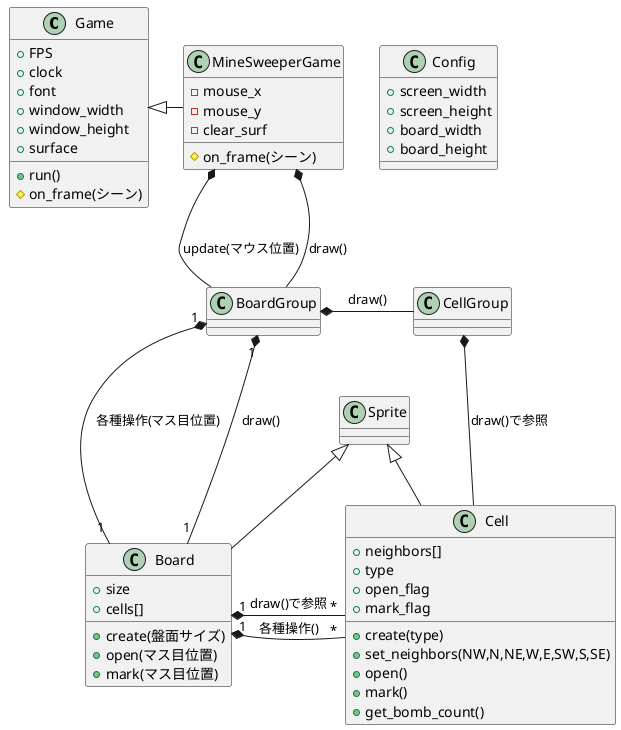

## クラス図

---
- class Config
    - screen_width
        スクリーン幅 [ピクセル]
    - screen_height
        スクリーン高 [ピクセル]
    - board_width
        ボード幅 [セル]
    - board_height
        ボード高 [セル]

---
- class Board
    - size
        盤面サイズ
    - cells[][]
        セルを保持する2次元配列（2行2列余分に確保）
    - create(盤面サイズ)
        以下を実施。
        - セルの生成
        - セル同士のリンクを張る。
        - 地雷の設置
    - open(マス目位置)
        盤面操作（地面を開ける）
    - mark(マス目位置)
        盤面操作（マーキングする）

---
- class Cell
    - type
        - TYPE_MINE : 地雷
        - TYPE_NONE : 非地雷。周りの地雷数。
    - open_flag
        - OPEN   : 開封済
        - CLOSED : 未開封
    - mark_flag
        - NOMARK : マークあり
        - MARKED : マークなし
    - create(type)
        地雷を設置。
    - set_neighbors(NW,N,NE,W,E,SW,S,SE)
        周りのセルとリンクを張る。
    - open()
        地面を開封する
        周りの地雷がない場合、周りを開いていく。
    - mark()
        マーキングする。
    - get_bomb_count()
        周りの地雷数を返す。

